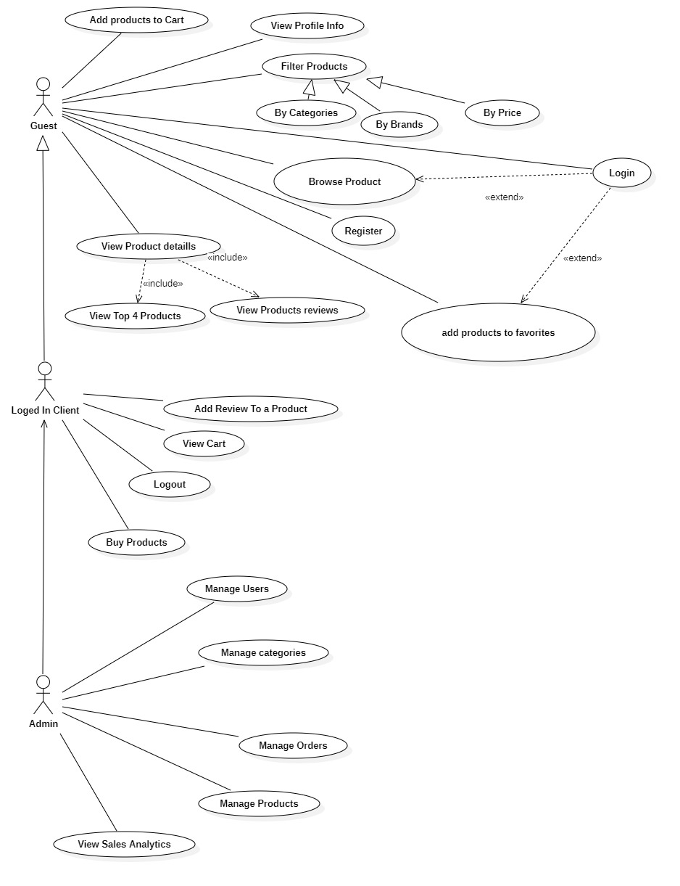
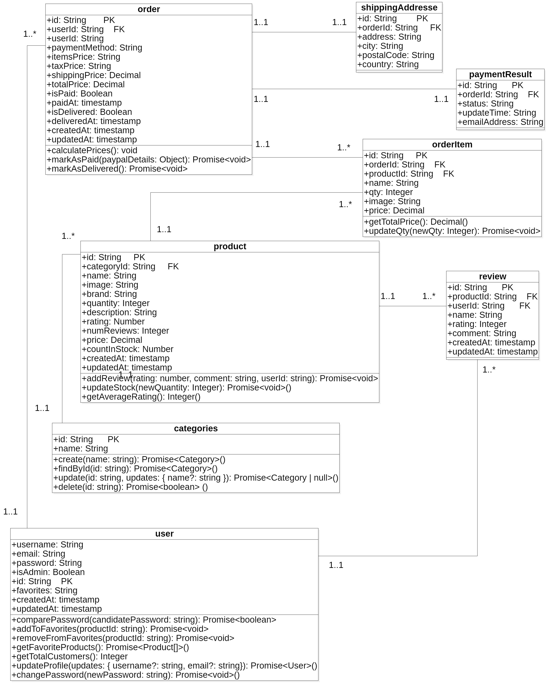
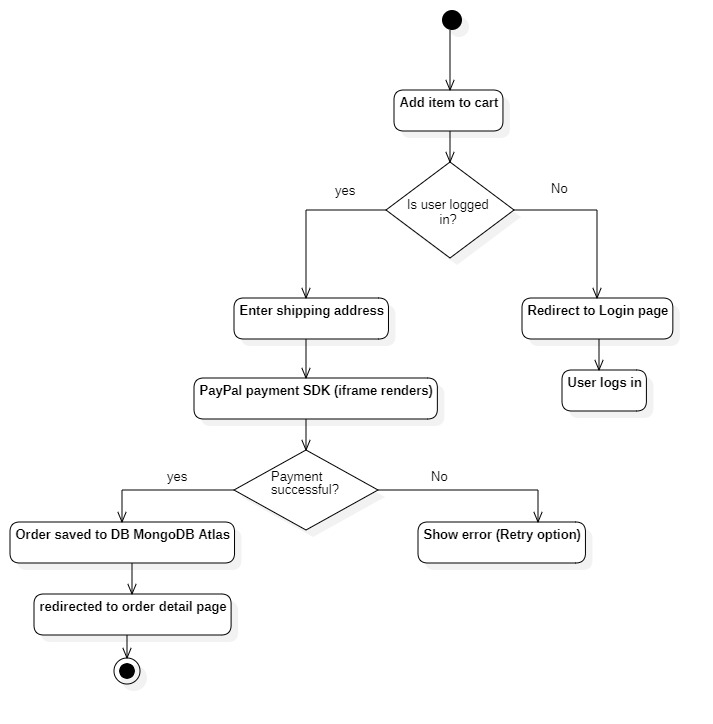
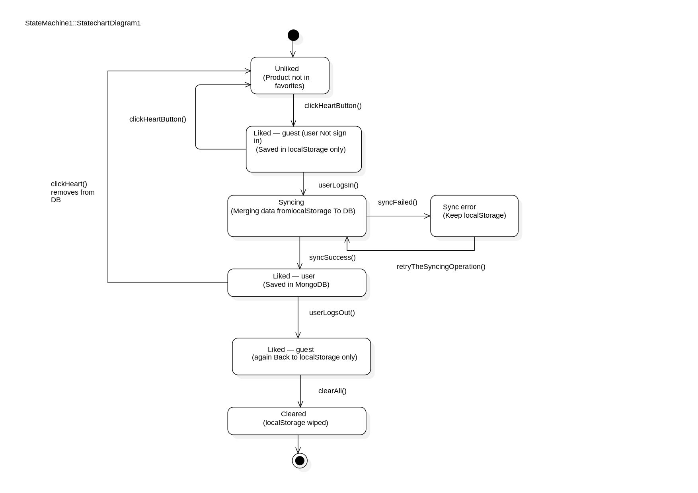

# 🛒 ShopSphere — Frontend

> A production-grade React e-commerce application featuring real-time state management, PayPal payment integration, an admin analytics dashboard, and a security-first authentication flow.

<br/>

[](https://reactjs.org/)
[](https://redux.js.org/)
[](https://tailwindcss.com/)
[](https://vitejs.dev/)
[](https://developer.paypal.com/)
[](https://shopsphere.vercel.app)

---

## 📋 Table of Contents

- [Overview](#-overview)
-[System Design](#-system-design)
- [Live Demo](#-live-demo)
- [Features](#-features)
- [Tech Stack](#-tech-stack)
- [State Management](#-state-management)
- [Getting Started](#-getting-started)
- [Environment Variables](#-environment-variables)
- [Project Structure](#-project-structure)
- [Key Engineering Decisions](#-key-engineering-decisions)
- [Backend Repo](#-backend-repo)

---

## 🌟 Overview

ShopSphere's frontend is a fully responsive React SPA covering the complete customer journey — from anonymous browsing to post-purchase order tracking — alongside a powerful admin panel with real-time analytics.

Built with **Redux Toolkit + RTK Query** for state management, it implements a security-first auth flow using HttpOnly cookies, a hybrid localStorage/MongoDB favorites strategy, and real-time UI updates without page refreshes.

---

## 🚀 Live Demo

👉 **[shopsphere.vercel.app](https://shops-frontend.vercel.app)**

**Live Demo:** `https://shops-frontend.vercel.app`
**Backend Repo:** `https://github.com/Tidjani1Bachir/shop-backend`

| Role | Email | Password |
|---|---|---|
| Admin | new@gmail.com | azerty |
| User | user@demo.com | azerty |

## 🗺 System Design

### Use Case Diagram
> Illustrates all user interactions with the system.



---

### Class Diagram
> Shows the data models and their relationships.



---

### Activity Diagram — Checkout Flow
> Shows the step-by-step checkout process with all decision branches.



---

### Sequence Diagram — PayPal Payment Flow
> Shows the communication between frontend, backend, PayPal SDK and MongoDB.


---

### Favorites State Machine
> Shows the hybrid localStorage and MongoDB favorites strategy.




## ✨ Features

### 🛍️ Customer-Facing
- **Product Discovery** — Filter by category, brand, and price range with a dynamic sidebar that auto-generates unique brand lists from live data
- **Product Detail Pages** — Top-rated product carousel (react-slick), customer reviews with ratings
- **Smart Cart** — Persistent cart with real-time quantity management and price calculation
- **Favorites / Wishlist** — Guest-friendly localStorage favorites with seamless cloud sync on login
- **Guest-to-User Transition** — Full cart and favorites merge on authentication, no data lost
- **Secure Checkout Flow** — Protected routes with redirect preservation (`/login?redirect=/shipping`)
- **PayPal Payment Integration** — Secure PayPal SDK iframe, PCI-compliant, no card data handled client-side
- **Order Tracking** — Full order history with paid/delivered status

### 🔧 Admin Dashboard
- **Sales Analytics** — Interactive ApexCharts line chart with smooth curve; exportable to CSV, PNG, SVG
- **Product Management** — Full CRUD with image upload
- **Order Management** — Mark orders as paid/delivered
- **User Management** — View and manage all registered users
- **Category Management** — Real-time CRUD with instant UI sync, no page refresh required

---

## 🛠 Tech Stack

| Technology | Purpose |
|---|---|
| React 18 | UI framework |
| Redux Toolkit + RTK Query | Global state & server-state management |
| React Router v6 | Client-side routing with protected routes |
| Tailwind CSS | Utility-first styling |
| ApexCharts (`react-apexcharts`) | Admin sales analytics charts |
| react-slick | Product carousel / slider |
| PayPal React SDK | Payment processing |
| Vite | Build tool & dev server |
| react-toastify | User notifications |
| moment.js | Date formatting |

---

## ⚡ State Management

### RTK Query — Real-Time Cache Invalidation
A key challenge was keeping the UI in sync with the server without manual page refreshes. Solved using RTK Query's tag-based cache invalidation:

```javascript
// When a category is CREATED/UPDATED/DELETED:
invalidatesTags: ["Category"]   // ← marks the cache as stale

// The GET endpoint watches for this:
providesTags: ["Category"]      // ← auto-refetches when tag is invalidated
```

This achieves **real-time UI updates** on admin operations without WebSockets or `window.location.reload()`.

### Favorites — Hybrid Storage Strategy

| State | Storage | Reason |
|---|---|---|
| Guest / Not logged in | `localStorage` | Zero latency, no account required, works offline |
| Logged in | MongoDB | Cross-device sync, marketing insights |
| Login event | Merge & sync | localStorage favorites merged into DB, no data lost |

### State Shape Consistency
All Redux slices use standardized fallback values (`[]` instead of `undefined`) when hydrating from localStorage, eliminating runtime errors for both new and returning users.

### Protected Routes & Redirect Preservation
```javascript
// User clicks checkout → not logged in
navigate("/login?redirect=/shipping");

// After login → redirected back to where they were
// Not just dumped on the homepage
```

---

## 🚀 Getting Started

### Prerequisites
- Node.js ≥ 18
- Backend API running (see [Backend Repo](https://github.com/yourusername/shopsphere-backend))

### Installation

```bash
# Clone the repository
git clone https://github.com/yourusername/shopsphere-frontend.git
cd shopsphere-frontend

# Install dependencies
npm install

# Create your .env file
cp example.env .env
# Add your backend URL in .env

# Run in development
npm run dev

# Build for production
npm run build
```

---

## 🔑 Environment Variables

Create a `.env` file in the root:

```env
VITE_API_URL=http://localhost:5000
```

For production, set this to your deployed backend URL:

```env
VITE_API_URL=https://shopsphere-backend.onrender.com
```

> ⚠️ All Vite environment variables must start with `VITE_` to be accessible in the browser.

---

## 📁 Project Structure

```
shopsphere-frontend/
├── src/
│   ├── components/         # Reusable UI components
│   │   ├── Header.jsx
│   │   ├── Footer.jsx
│   │   ├── ProductCard.jsx
│   │   └── ...
│   ├── pages/              # Route-level page components
│   │   ├── Home.jsx
│   │   ├── ProductDetail.jsx
│   │   ├── Cart.jsx
│   │   ├── Checkout/
│   │   │   ├── Shipping.jsx
│   │   │   └── Order.jsx
│   │   └── Admin/
│   │       ├── Dashboard.jsx
│   │       ├── ProductList.jsx
│   │       └── ...
│   ├── redux/
│   │   ├── api/            # RTK Query API slices
│   │   │   ├── apiSlice.js
│   │   │   ├── productsApiSlice.js
│   │   │   ├── ordersApiSlice.js
│   │   │   └── ...
│   │   └── features/       # Redux state slices
│   │       ├── authSlice.js
│   │       ├── cartSlice.js
│   │       └── favoritesSlice.js
│   ├── utils/              # localStorage helpers, constants
│   ├── App.jsx
│   └── main.jsx
├── index.html
├── vite.config.js
├── tailwind.config.js
├── package.json
└── example.env
```

---

## 💡 Key Engineering Decisions

### RTK Query over Manual `useEffect` + `fetch`
RTK Query eliminates entire categories of bugs: loading/error state management, cache staleness, race conditions, and duplicate requests. The tag-based invalidation system replaced what would otherwise require polling, WebSockets, or complex manual state sync.

### HttpOnly Cookie Auth (No Token in Redux)
The JWT never touches JavaScript — it lives in an HttpOnly cookie managed entirely by the browser. This means no token stored in Redux state, no manual `Authorization` headers, and complete XSS immunity for the auth token.

### PayPal SDK iframe vs. Custom Button
The `<PayPalButtons />` component renders inside a PayPal-controlled iframe. The application never sees or handles credit card numbers, making PCI DSS compliance vastly simpler. PayPal handles fraud detection, currency conversion, and locale-aware rendering automatically.

### localStorage for Guest Favorites
Speed is the priority — localStorage updates are instantaneous with zero latency. Users can save favorites without creating an account, lowering the barrier to conversion. On login, the local list syncs to MongoDB so nothing is lost.

---

## 🔗 Backend Repo

The Node.js + Express API that powers this frontend:
👉 [shopsphere-backend](https://github.com/yourusername/shopsphere-backend)

---

## 📄 License

This project is licensed under the MIT License.

---

<div align="center">
  Built with ❤️ using React + Redux + Tailwind
  <br/>
  <sub>Designed for scale. Built with security. Crafted for users.</sub>
</div>
